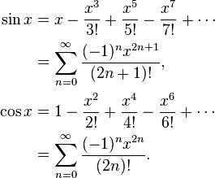

# Constant Trigonometric Functions

This header-only library recursively computes the Taylor Series expansions for sine and cosine (and derives tangent) using C++ template metaprogramming.



**Note:** This is deprecated with [constexpr](https://msdn.microsoft.com/en-us/library/dn956974.aspx) starting in C++11.

## Usage

There are two caveats with this library that ugly up the syntax more than a normal template metaprogram:
1. The current C++ standard (§14.3.2) at this time does not support floating point template arguments. As such, to use this library you need to wrap any input in container structs like the one in the example:
```C++
struct var
{
    static const long double value;
};

const long double var::value = M_PI / 4;
//M_PI is from the cmath library included earlier
```
2. You need to specify the recursion depth when initially calling the expansions. A recursion depth of 8 gives pretty decent accuracy without breaking my computer. The expansions are very computationally expensive and will anger the compiler if a maximum depth is exceeded. I'm not sure how to change the maximum recursion depth *in the compilation stage*, but if that was possible that would allow you to go even higher.

**Note:** A recursion depth of ```n``` corresponds to a ```2n-1``` degree sine expansion and a ```2n``` degree cosine expansion. Using the [Lagrange error bound](https://en.wikipedia.org/wiki/Taylor%27s_theorem) of the sine and cosine expansions we can demonstrate that a recursion depth of 8 will have a margin of error ~~equal to~~ good enough for practical use.

With these in mind, accessing the values of the functions looks like this:
```C++ 
#define DEPTH 8

const long double ans = ct::sin<var, DEPTH>::value;
```

